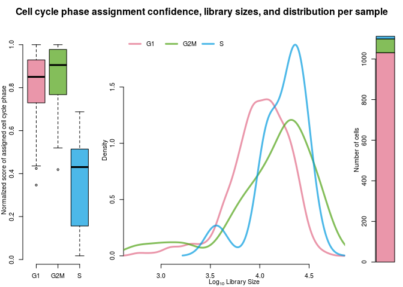
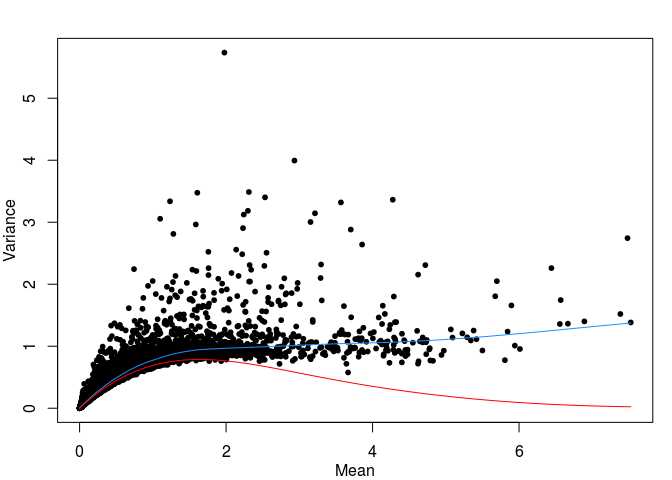

Brendan’s skeleton scRNAseq workflow using scran, Seurat, and scClustViz
========================================================================

This is an RStudio notebook that reflects my opinion of best practices
in single-sample processing of scRNAseq data from the 10X Genomics
platform. It is heavily based on the
[SimpleSingleCell](https://bioconductor.org/packages/release/workflows/vignettes/simpleSingleCell/inst/doc/tenx.html)
and [Seurat](https://satijalab.org/seurat/v3.1/pbmc3k_tutorial.html)
tutorials. Normalization is performed using *scran*, with *Seurat* for
clustering. Clustering is performed iteratively at higher resolutions
and stopped when differential expression between clusters is lost, as
assessed by [scClustViz](https://baderlab.github.io/scClustViz/) using
the wilcoxon rank-sum test.

At the start of every code block there will be variables to edit to
modify the output of that block. I encourage users to run each block
individual, assess the output, and modify as needed. scRNAseq analysis
is not plug-and-play.

``` r
# This code block won't run, but shows the commands to install the required packages

install.packages(c("Seurat","BiocManager","devtools","Matrix"))
BiocManager::install(c("DropletUtils","scater","scran","AnnotationDbi",
                       "EnsDb.Mmusculus.v79","EnsDb.Hsapiens.v86",
                       "org.Mm.eg.db","org.Hs.eg.db"))
devtools::install_github("immunogenomics/presto")
devtools::install_github("BaderLab/scClustViz")
```

``` r
library(EnsDb.Mmusculus.v79) #library(EnsDb.Hsapiens.v86) if human
```

    ## Loading required package: ensembldb

    ## Loading required package: BiocGenerics

    ## Loading required package: parallel

    ## 
    ## Attaching package: 'BiocGenerics'

    ## The following objects are masked from 'package:parallel':
    ## 
    ##     clusterApply, clusterApplyLB, clusterCall, clusterEvalQ,
    ##     clusterExport, clusterMap, parApply, parCapply, parLapply,
    ##     parLapplyLB, parRapply, parSapply, parSapplyLB

    ## The following objects are masked from 'package:stats':
    ## 
    ##     IQR, mad, sd, var, xtabs

    ## The following objects are masked from 'package:base':
    ## 
    ##     anyDuplicated, append, as.data.frame, basename, cbind,
    ##     colnames, dirname, do.call, duplicated, eval, evalq, Filter,
    ##     Find, get, grep, grepl, intersect, is.unsorted, lapply, Map,
    ##     mapply, match, mget, order, paste, pmax, pmax.int, pmin,
    ##     pmin.int, Position, rank, rbind, Reduce, rownames, sapply,
    ##     setdiff, sort, table, tapply, union, unique, unsplit, which,
    ##     which.max, which.min

    ## Loading required package: GenomicRanges

    ## Loading required package: stats4

    ## Loading required package: S4Vectors

    ## 
    ## Attaching package: 'S4Vectors'

    ## The following object is masked from 'package:base':
    ## 
    ##     expand.grid

    ## Loading required package: IRanges

    ## Loading required package: GenomeInfoDb

    ## Loading required package: GenomicFeatures

    ## Loading required package: AnnotationDbi

    ## Loading required package: Biobase

    ## Welcome to Bioconductor
    ## 
    ##     Vignettes contain introductory material; view with
    ##     'browseVignettes()'. To cite Bioconductor, see
    ##     'citation("Biobase")', and for packages 'citation("pkgname")'.

    ## Loading required package: AnnotationFilter

    ## 
    ## Attaching package: 'ensembldb'

    ## The following object is masked from 'package:stats':
    ## 
    ##     filter

``` r
library(org.Mm.eg.db) #library(org.Hs.eg.db) if human
```

    ## 

``` r
library(AnnotationDbi)
library(Matrix)
```

    ## 
    ## Attaching package: 'Matrix'

    ## The following object is masked from 'package:S4Vectors':
    ## 
    ##     expand

``` r
library(DropletUtils)
```

    ## Loading required package: SingleCellExperiment

    ## Loading required package: SummarizedExperiment

    ## Loading required package: DelayedArray

    ## Loading required package: matrixStats

    ## 
    ## Attaching package: 'matrixStats'

    ## The following objects are masked from 'package:Biobase':
    ## 
    ##     anyMissing, rowMedians

    ## Loading required package: BiocParallel

    ## 
    ## Attaching package: 'DelayedArray'

    ## The following objects are masked from 'package:matrixStats':
    ## 
    ##     colMaxs, colMins, colRanges, rowMaxs, rowMins, rowRanges

    ## The following objects are masked from 'package:base':
    ## 
    ##     aperm, apply, rowsum

    ## Registered S3 method overwritten by 'R.oo':
    ##   method        from       
    ##   throw.default R.methodsS3

``` r
library(scater)
```

    ## Loading required package: ggplot2

    ## 
    ## Attaching package: 'scater'

    ## The following object is masked from 'package:ensembldb':
    ## 
    ##     filter

    ## The following object is masked from 'package:S4Vectors':
    ## 
    ##     rename

    ## The following object is masked from 'package:stats':
    ## 
    ##     filter

``` r
library(scran)
library(Seurat)
```

    ## 
    ## Attaching package: 'Seurat'

    ## The following object is masked from 'package:SummarizedExperiment':
    ## 
    ##     Assays

``` r
library(scClustViz)
```

    ## Loading required package: shiny

    ## This version of Shiny is designed to work with 'htmlwidgets' >= 1.5.
    ##     Please upgrade via install.packages('htmlwidgets').

Read in data
------------

10X Genomics Cell Ranger v3 uses a much better heuristic for determining
empty droplets, so its generally safe to go straight to using the
filtered matrix.

``` r
input_from_10x <- "filtered_feature_bc_matrix"

sce <- read10xCounts(input_from_10x,col.names=T)
sce <- sce[rowSums(counts(sce)) > 0,]
show(sce)
```

    ## class: SingleCellExperiment 
    ## dim: 18085 1301 
    ## metadata(0):
    ## assays(1): counts
    ## rownames(18085): ENSMUSG00000051951 ENSMUSG00000089699 ...
    ##   ENSMUSG00000063897 ENSMUSG00000095742
    ## rowData names(3): ID Symbol Type
    ## colnames(1301): AAACGAATCAAAGCCT-1 AAACGCTGTAATGTGA-1 ...
    ##   TTTGGTTAGTAATCCC-1 TTTGTTGGTATGGAAT-1
    ## colData names(2): Sample Barcode
    ## reducedDimNames(0):
    ## spikeNames(0):

Filter cells
------------

``` r
location <- mapIds(EnsDb.Mmusculus.v79, # EnsDb.Hsapiens.v86 if human
                   keys=rowData(sce)$ID, 
                   column="SEQNAME",
                   keytype="GENEID") 
# ^ you might have to change this depending on your rownames in the data
rowData(sce)$CHR <- location

sce <- calculateQCMetrics(sce,percent_top=NA,use_spikes=F,
                          feature_controls=list(Mito=which(location=="MT")))
rowData(sce)$pct_detected <- 100 - rowData(sce)$pct_dropout_by_counts
rowData(sce)$mean_detected_counts <- rowData(sce)$mean_counts / (rowData(sce)$pct_detected * 0.01)
```

Filtering cells based on the proportion of mitochondrial gene
transcripts per cell. A high proportion of mitochondrial gene
transcripts are indicative of poor quality cells, probably due to
compromised cell membranes.

``` r
mads_thresh <- 4
hard_thresh <- 50

mito_thresh <- median(sce$pct_counts_Mito) + mad(sce$pct_counts_Mito) * mads_thresh
drop_mito <- sce$pct_counts_Mito > mito_thresh | sce$pct_counts_Mito > hard_thresh

par(mar=c(3,3,2,1),mgp=2:0)
hist(sce$pct_counts_Mito,breaks=50,xlab="% mitochondrial mRNA")
abline(v=mito_thresh,col="red",lwd=2)
mtext(paste(paste0(mads_thresh," MADs over median: "),
            paste0(round(mito_thresh,2),"% mitochondrial mRNA"),
            paste0(sum(drop_mito)," cells removed"),
            sep="\n"),
      side=3,line=-3,at=mito_thresh,adj=-0.05)
```


``` r
temp_col <- colorspace::sequential_hcl(100,palette="Viridis",alpha=0.5,rev=T)
par(mfrow=c(1,2),mar=c(3,3,2,1),mgp=2:0)
plot(sce$total_counts,sce$total_features_by_counts,log="xy",pch=20,
     xlab="total_counts",ylab="total_features",
     col=temp_col[cut(c(0,1,sce$pct_counts_Mito),100,labels=F)[c(-1,-2)]])
legend("topleft",bty="n",title="Mito %",
       legend=c(0,50,100),pch=20,col=temp_col[c(1,50,100)])
plot(sce$total_counts,sce$total_features_by_counts,log="xy",pch=20,
     xlab="total_counts",ylab="total_features",
     col=temp_col[cut(c(0,1,sce$pct_counts_Mito),100,labels=F)[c(-1,-2)]])
points(sce$total_counts[drop_mito],sce$total_features_by_counts[drop_mito],
       pch=4,col="red")
legend("topleft",bty="n",pch=4,col="red",
       title=paste("Mito % >",round(mito_thresh,2)),
       legend=paste(sum(drop_mito),"cells"))
```


``` r
sce <- sce[,!drop_mito]
show(sce)
```

    ## class: SingleCellExperiment 
    ## dim: 18085 1144 
    ## metadata(0):
    ## assays(1): counts
    ## rownames(18085): ENSMUSG00000051951 ENSMUSG00000089699 ...
    ##   ENSMUSG00000063897 ENSMUSG00000095742
    ## rowData names(14): ID Symbol ... pct_detected mean_detected_counts
    ## colnames(1144): AAACGCTGTAATGTGA-1 AAACGCTGTCCTGGGT-1 ...
    ##   TTTGGTTAGTAATCCC-1 TTTGTTGGTATGGAAT-1
    ## colData names(22): Sample Barcode ... log10_total_counts_Mito
    ##   pct_counts_Mito
    ## reducedDimNames(0):
    ## spikeNames(0):

It is important to manually inspect the relationship between library
size and gene detection rates per cell to identify obvious outliers. In
this case, we’ve identified a population of cells with a different
relationship between library size and complexity, as well as one cell
with a clearly outlying library size.

``` r
filt_intercept <- 100
filt_slope <- .055
to_inspect <- sce$total_features_by_counts < (sce$total_counts * filt_slope + filt_intercept)

temp_col <- colorspace::sequential_hcl(100,palette="Viridis",alpha=0.5,rev=T)
par(mfrow=c(1,2),mar=c(3,3,2,1),mgp=2:0)
plot(sce$total_counts,sce$total_features_by_counts,log="",pch=20,
     xlab="total_counts",ylab="total_features",
     main="Select outliers to inspect",
     col=temp_col[cut(c(0,1,sce$pct_counts_Mito),100,labels=F)[c(-1,-2)]])
legend("topleft",bty="n",title="Mito %",
       legend=c(0,50,100),pch=20,col=temp_col[c(1,50,100)])
abline(filt_intercept,filt_slope,lwd=2,col="red")


plot(sce$total_counts,sce$total_features_by_counts,log="xy",pch=20,
     xlab="total_counts",ylab="total_features",
     main="Select outliers to inspect",
     col=temp_col[cut(c(0,1,sce$pct_counts_Mito),100,labels=F)[c(-1,-2)]])
points(sce$total_counts[to_inspect],sce$total_features_by_counts[to_inspect],pch=1,col="red")
legend("topleft",bty="n",pch=1,col="red",legend="Outliers")
```


By comparing the transcriptomes of the outlier cells to the remaining
cells, we see that they’re likely erythrocytes and can be removed.

``` r
out_DR <- pbapply::pbapply(counts(sce)[,to_inspect],1,function(X) sum(X > 0) / length(X))
out_MDGE <- pbapply::pbapply(counts(sce)[,to_inspect],1,function(X) mean(X[X > 0]))

par(mfrow=c(1,2),mar=c(3,3,2,1),mgp=2:0)
plot(mean_detected_counts~pct_detected,data=rowData(sce),
     pch=".",cex=2,log="y",main="Gene expression in all cells",
     xlab="Detection Rate",ylab="Mean Detected Count")
points(mean_detected_counts~pct_detected,
       data=rowData(sce)[grep("^Hb[ab]",rowData(sce)$Symbol),],
       pch=20,col="red")
plot(out_DR,out_MDGE,pch=".",cex=2,log="y",
     xlab="Detection Rate",ylab="Mean Detected Count",
     main="Gene expression in outliers")
points(out_DR[grep("^Hb[ab]",rowData(sce)$Symbol)],
       out_MDGE[grep("^Hb[ab]",rowData(sce)$Symbol)],
       pch=20,col="red")
legend("topleft",bty="n",pch=20,col="red",legend="Haemoglobin")
```


``` r
remove_outliers <- TRUE

if (remove_outliers) {
  sce <- sce[,!to_inspect]
}
show(sce)
```

    ## class: SingleCellExperiment 
    ## dim: 18085 1112 
    ## metadata(0):
    ## assays(1): counts
    ## rownames(18085): ENSMUSG00000051951 ENSMUSG00000089699 ...
    ##   ENSMUSG00000063897 ENSMUSG00000095742
    ## rowData names(14): ID Symbol ... pct_detected mean_detected_counts
    ## colnames(1112): AAACGCTGTAATGTGA-1 AAACGCTGTCCTGGGT-1 ...
    ##   TTTGGTTAGTAATCCC-1 TTTGTTGGTATGGAAT-1
    ## colData names(22): Sample Barcode ... log10_total_counts_Mito
    ##   pct_counts_Mito
    ## reducedDimNames(0):
    ## spikeNames(0):

Filter genes
------------

Remove genes detected in 3 or fewer cells, to prevent errors in
normalization.

``` r
sce <- sce[rowSums(counts(sce)) >= 3,]
rownames(sce) <- uniquifyFeatureNames(rowData(sce)$ID, rowData(sce)$Symbol)
# Assign gene symbols as rownames. 
# You might have to change this depending on your rownames
show(sce)
```

    ## class: SingleCellExperiment 
    ## dim: 15669 1112 
    ## metadata(0):
    ## assays(1): counts
    ## rownames(15669): Xkr4 Sox17 ... AC149090.1 CAAA01118383.1
    ## rowData names(14): ID Symbol ... pct_detected mean_detected_counts
    ## colnames(1112): AAACGCTGTAATGTGA-1 AAACGCTGTCCTGGGT-1 ...
    ##   TTTGGTTAGTAATCCC-1 TTTGTTGGTATGGAAT-1
    ## colData names(22): Sample Barcode ... log10_total_counts_Mito
    ##   pct_counts_Mito
    ## reducedDimNames(0):
    ## spikeNames(0):

Cell cycle prediction with cyclone
----------------------------------

Cyclone generates individual scores for each cell cycle phase. G1 and
G2/M are assigned based on these scores, and any cells not strongly
scoring for either phase are assigned to S phase.

``` r
cycloneSpeciesMarkers <- "mouse_cycle_markers.rds" # "human_cycle_markers.rds"
egDB <- "org.Mm.eg.db" # "org.Hs.eg.db" if human

anno <- select(get(egDB), keys=rownames(sce), keytype="SYMBOL", column="ENSEMBL")
```

    ## 'select()' returned 1:many mapping between keys and columns

``` r
cycScores <- cyclone(sce,gene.names=anno$ENSEMBL[match(rownames(sce),anno$SYMBOL)],
                         pairs=readRDS(system.file("exdata",cycloneSpeciesMarkers,package="scran")))
cycScores$phases <- as.factor(cycScores$phases)
cycScores$confidence <- sapply(seq_along(cycScores$phases),function(i)
  cycScores$normalized.scores[i,as.character(cycScores$phases[i])])
for (l in names(cycScores)) {
  if (is.null(dim(cycScores[[l]]))) {
    names(cycScores[[l]]) <- colnames(sce)
  } else {
    rownames(cycScores[[l]]) <- colnames(sce)
  }
}
colData(sce)$CyclonePhase <- cycScores$phases
colData(sce)$CycloneConfidence <- cycScores$confidence
```

``` r
layout(matrix(c(1,2,1,3,1,4),2),widths=c(2,5,1),heights=c(1,9))
par(mar=rep(0,4),mgp=2:0)
plot.new()
title("Cell cycle phase assignment confidence, library sizes, and distribution per sample",line=-2,cex.main=1.5)

par(mar=c(3,3,1,1),bty="n")
boxplot(tapply(cycScores$confidence,cycScores$phases,c),
        col=colorspace::qualitative_hcl(3,alpha=.7,palette="Dark 3"),
        ylab="Normalized score of assigned cell cycle phase")

par(mar=c(3,3,1,1))
cycDlibSize <- tapply(log10(colData(sce)$total_counts),cycScores$phases,function(X) density(X))
plot(x=NULL,y=NULL,ylab="Density",xlab=expression(Log[10]~"Library Size"),
     xlim=range(log10(colData(sce)$total_counts)),
     ylim=c(min(sapply(cycDlibSize,function(X) min(X$y))),
            max(sapply(cycDlibSize,function(X) max(X$y)))))
for (x in 1:length(cycDlibSize)) {
  lines(cycDlibSize[[x]],lwd=3,
        col=colorspace::qualitative_hcl(3,alpha=.7,palette="Dark 3")[x])
}
legend("topleft",bty="n",horiz=T,lwd=rep(3,3),legend=levels(cycScores$phases),
       col=colorspace::qualitative_hcl(3,alpha=.7,palette="Dark 3"))

par(mar=c(3,3,1,1))
barplot(cbind(table(cycScores$phases)),
  col=colorspace::qualitative_hcl(3,alpha=.7,palette="Dark 3"),
  ylab="Number of cells")
```



Normalization
-------------

Next step is normalization. Marioni proposed a normalization technique
that attempts to generate cell-specific size factors that are robust to
differential expression between genes in a heterogenous sample, unlike
simple library-size normalization
(<a href="https://genomebiology.biomedcentral.com/articles/10.1186/s13059-016-0947-7" class="uri">https://genomebiology.biomedcentral.com/articles/10.1186/s13059-016-0947-7</a>).
This method correlates strongly with library size normalization for
homogenous samples, but solves a series of linear equations to
deconvolute cell-specific size factors for normalization. In order to
better handle heterogenous data, they suggest separating the data by
simple heirarchical clustering of a Spearman correlation-based distance
metric so that they can normalize the separate subpopulations separately
to prevent the suppression of true differential expression during
normalization.

Normalization is carried out by assigning size factors per gene by the
pooling and deconvolution method, then taking the log-ratio between each
count and its size factor, and adding a pseudocount of one.
Log-transforming the data stabilizes variance by reducing the impact of
a few highly variable genes.

Check that clusters aren’t too correlated with library size.

``` r
temp_qcl <- quickCluster(sce,use.ranks=F,method="igraph",
                         irlba.args=list(maxit=1000)) # for convergence.
sce <- computeSumFactors(sce,min.mean=0.01,cluster=temp_qcl)

par(mfrow=c(1,2),mar=c(3,3,1,1),mgp=2:0)
plot(sce$total_counts,sizeFactors(sce),log="xy",pch=20,
     col=colorspace::qualitative_hcl(length(levels(temp_qcl)),alpha=.7,palette="Dark 3")[temp_qcl])
legend("topleft",bty="n",horiz=F,legend=levels(temp_qcl),title="Cluster",
       pch=20,col=colorspace::qualitative_hcl(length(levels(temp_qcl)),alpha=.7,palette="Dark 3"))
plot(sce$total_counts,sizeFactors(sce),log="",pch=20,
     col=colorspace::qualitative_hcl(length(levels(temp_qcl)),alpha=.7,palette="Dark 3")[temp_qcl])
legend("topleft",bty="n",horiz=F,legend=levels(temp_qcl),title="Cluster",
       pch=20,col=colorspace::qualitative_hcl(length(levels(temp_qcl)),alpha=.7,palette="Dark 3"))
```


``` r
sce <- normalize(sce)
```

Highly-variable genes
---------------------

``` r
new.trend <- makeTechTrend(x=sce)

fit <- trendVar(sce,use.spikes=FALSE,loess.args=list(span=0.05))
par(mar=c(3,3,2,1),mgp=2:0)
plot(fit$mean,fit$var,pch=20,
     xlab="Mean",ylab="Variance")
curve(fit$trend(x),col="dodgerblue",add=TRUE)
curve(new.trend(x),col="red",add=TRUE)
```



``` r
fit$trend <- new.trend # overwrite trend.
dec <- decomposeVar(fit=fit) # use per-gene variance estimates in 'fit'.
top.dec <- dec[order(dec$bio, decreasing=TRUE),] 
```

To Seurat!
----------

``` r
seur <- as.Seurat(sce)
```

    ## Warning: Feature names cannot have underscores ('_'), replacing with dashes
    ## ('-')

    ## Warning: Feature names cannot have underscores ('_'), replacing with dashes
    ## ('-')

``` r
seur@meta.data <- seur@meta.data[,c("Sample","total_counts","total_features_by_counts",
                                    "pct_counts_Mito","CyclonePhase","CycloneConfidence")]
colnames(seur@meta.data)[colnames(seur@meta.data) == "total_features_by_counts"] <- "total_features"
# ^cleaning up metadata
```

``` r
seur <- ScaleData(seur,check.for.norm=F)
```

    ## Warning: The following arguments are not used: check.for.norm

    ## Centering and scaling data matrix

``` r
seur <- CellCycleScoring(seur,
                         g2m.features=cc.genes$g2m.genes,
                         s.features=cc.genes$s.genes)
```

    ## Warning in AddModuleScore(object = object, features = features, name =
    ## name, : Could not find enough features in the object from the following
    ## feature lists: S.Score Attempting to match case...Could not find enough
    ## features in the object from the following feature lists: G2M.Score
    ## Attempting to match case...

``` r
seur <- RunPCA(seur,features=rownames(top.dec)[1:2000],verbose=F)
ElbowPlot(seur,ndims=50)
```


Select the number of principle components to use in downstream analysis,
and set *n\_pc* accordingly.

``` r
n_pc <- 20

seur <- RunTSNE(seur,dims=1:n_pc,reduction="pca",perplexity=30)
plot_tsne(cell_coord=getEmb(seur,"tsne"),
          md=getMD(seur)$total_counts,
          md_title="total_counts",
          md_log=T)
```


Playing with the perplexity parameter can improve the visualization.
Perplexity can be interpretted as the number of nearby cells to consider
when trying to minimize distance between neighbouring cells.

``` r
# only run if you've installed UMAP - see ?RunUMAP

seur <- RunUMAP(seur,dims=1:n_pc,reduction="pca")
```

    ## Warning: The default method for RunUMAP has changed from calling Python UMAP via reticulate to the R-native UWOT using the cosine metric
    ## To use Python UMAP via reticulate, set umap.method to 'umap-learn' and metric to 'correlation'
    ## This message will be shown once per session

    ## 15:26:57 UMAP embedding parameters a = 0.9922 b = 1.112

    ## 15:26:57 Read 1112 rows and found 20 numeric columns

    ## 15:26:57 Using Annoy for neighbor search, n_neighbors = 30

    ## 15:26:57 Building Annoy index with metric = cosine, n_trees = 50

    ## 0%   10   20   30   40   50   60   70   80   90   100%

    ## [----|----|----|----|----|----|----|----|----|----|

    ## **************************************************|
    ## 15:26:57 Writing NN index file to temp file /tmp/RtmpuJ8RKc/file7c56290f131
    ## 15:26:57 Searching Annoy index using 1 thread, search_k = 3000
    ## 15:26:58 Annoy recall = 100%
    ## 15:26:58 Commencing smooth kNN distance calibration using 1 thread
    ## 15:27:00 Initializing from normalized Laplacian + noise
    ## 15:27:00 Commencing optimization for 500 epochs, with 41286 positive edges
    ## 15:27:03 Optimization finished

``` r
plot_tsne(cell_coord=getEmb(seur,"umap"),
          md=getMD(seur)$total_counts,
          md_title="total_counts",
          md_log=T)
```


Iterative clustering with scClustViz
------------------------------------

Seurat implements an interpretation of SNN-Cliq
(<a href="https://doi.org/10.1093/bioinformatics/btv088" class="uri">https://doi.org/10.1093/bioinformatics/btv088</a>)
for clustering of single-cell expression data. They use PCs to define
the distance metric, then embed the cells in a graph where edges between
cells (nodes) are weighted based on their similarity (euclidean distance
in PCA space). These edge weights are refined based on Jaccard distance
(overlap in local neighbourhoods), and then communities
(“quasi-cliques”) are identified in the graph using a smart local moving
algorithm (SLM,
<a href="http://dx.doi.org/10.1088/1742-5468/2008/10/P10008" class="uri">http://dx.doi.org/10.1088/1742-5468/2008/10/P10008</a>)
to optimize the modularity measure of the defined communities in the
graph.

This code block iterates through “resolutions” of the Seurat clustering
method, testing each for overfitting. Overfitting is determined by
testing differential expression between all pairs of clusters using a
wilcoxon rank-sum test. If there are no significantly differentially
expressed genes between nearest neighbouring clusters, iterative
clustering is stopped. The output is saved as an sCVdata object for use
in scClustViz.

``` r
max_seurat_resolution <- 0.6 # For the sake of the demo, quit early.
## ^ change this to something large (5?) to ensure iterations stop eventually.
output_filename <- "./for_scClustViz.RData"
FDRthresh <- 0.01 # FDR threshold for statistical tests
min_num_DE <- 1
seurat_resolution <- 0 # Starting resolution is this plus the jump value below.
seurat_resolution_jump <- 0.2

seur <- FindNeighbors(seur,dims=1:n_pc,verbose=F)

sCVdata_list <- list()
DE_bw_clust <- TRUE
while(DE_bw_clust) {
  if (seurat_resolution >= max_seurat_resolution) { break }
  seurat_resolution <- seurat_resolution + seurat_resolution_jump 
  # ^ iteratively incrementing resolution parameter 
  
  seur <- FindClusters(seur,resolution=seurat_resolution,verbose=F)
  
  message(" ")
  message("------------------------------------------------------")
  message(paste0("--------  res.",seurat_resolution," with ",
                 length(levels(Idents(seur)))," clusters --------"))
  message("------------------------------------------------------")
  
  if (length(levels(Idents(seur))) <= 1) { 
    message("Only one cluster found, skipping analysis.")
    next 
  } 
  # ^ Only one cluster was found, need to bump up the resolution!
  
  if (length(sCVdata_list) >= 1) {
    temp_cl <- length(levels(Clusters(sCVdata_list[[length(sCVdata_list)]])))
    if (temp_cl == length(levels(Idents(seur)))) { 
      temp_cli <- length(levels(interaction(
        Clusters(sCVdata_list[[length(sCVdata_list)]]),
        Idents(seur),
        drop=T
      )))
      if (temp_cli == length(levels(Idents(seur)))) { 
        message("Clusters unchanged from previous, skipping analysis.")
        next 
      }
    }
  }
  
  curr_sCVdata <- CalcSCV(
    inD=seur,
    assayType="RNA",
    cl=Idents(seur), 
    # ^ your most recent clustering results get stored in the Seurat "ident" slot
    exponent=2, 
    # ^ since you used scran for normalization, data is in log2 space.
    pseudocount=1,
    DRthresh=0.1,
    DRforClust="pca",
    calcSil=T,
    calcDEvsRest=T,
    calcDEcombn=T
  )
  
  DE_bw_NN <- sapply(DEneighb(curr_sCVdata,FDRthresh),nrow)
  # ^ counts # of DE genes between neighbouring clusters at your selected FDR threshold
  message(paste("Number of DE genes between nearest neighbours:",min(DE_bw_NN)))
  
  if (min(DE_bw_NN) < min_num_DE) { DE_bw_clust <- FALSE }
  # ^ If no DE genes between nearest neighbours, don't loop again.
  
  sCVdata_list[[paste0("res.",seurat_resolution)]] <- curr_sCVdata
}
```

    ## 

    ## ------------------------------------------------------

    ## --------  res.0.2 with 5 clusters --------

    ## ------------------------------------------------------

    ## Loading required package: cluster

    ## -- Calculating gene detection rate per cluster --

    ## -- Calculating mean detected gene expression per cluster --

    ## -- Calculating mean gene expression per cluster --

    ## -- Calculating differential expression cluster vs rest effect size --

    ## Loading required package: presto

    ## Loading required package: Rcpp

    ## -- Testing differential expression cluster vs rest --

    ## -- Testing differential expression between clusters --

    ## Number of DE genes between nearest neighbours: 214

    ## 

    ## ------------------------------------------------------

    ## --------  res.0.4 with 7 clusters --------

    ## ------------------------------------------------------

    ## -- Calculating gene detection rate per cluster --

    ## -- Calculating mean detected gene expression per cluster --

    ## -- Calculating mean gene expression per cluster --

    ## -- Calculating differential expression cluster vs rest effect size --

    ## -- Testing differential expression cluster vs rest --

    ## -- Testing differential expression between clusters --

    ## Number of DE genes between nearest neighbours: 231

    ## 

    ## ------------------------------------------------------

    ## --------  res.0.6 with 10 clusters --------

    ## ------------------------------------------------------

    ## -- Calculating gene detection rate per cluster --

    ## -- Calculating mean detected gene expression per cluster --

    ## -- Calculating mean gene expression per cluster --

    ## -- Calculating differential expression cluster vs rest effect size --

    ## -- Testing differential expression cluster vs rest --

    ## -- Testing differential expression between clusters --

    ## Number of DE genes between nearest neighbours: 101

``` r
seur@meta.data <- seur@meta.data[,colnames(seur@meta.data) != "seurat_clusters"]
# cleaning redundant metadata

# seur <- seur@assays$RNA@scale.data <- matrix(nrow=0,ncol=0)
# ^ shrinks the size of the Seurat object by removing the scaled matrix
# could use DietSeurat, but it removes dimensionality reductions by default!

save(sCVdata_list,seur,file=output_filename)
```

View the scClustViz report by running this code chunk.

``` r
runShiny(output_filename,
         cellMarkers=list( #change this to suit your needs, or remove it
           "Cortical precursors"=c("Mki67","Sox2","Pax6","Pcna",
                                   "Nes","Cux1","Cux2"), 
           "Interneurons"=c("Gad1","Gad2","Npy","Sst","Lhx6",
                            "Tubb3","Rbfox3","Dcx"), 
           "Cajal-Retzius neurons"="Reln", 
           "Intermediate progenitors"="Eomes", 
           "Projection neurons"=c("Tbr1","Satb2","Fezf2","Bcl11b","Tle4","Nes",
                                  "Cux1","Cux2","Tubb3","Rbfox3","Dcx")
         ),
         annotationDB="org.Mm.eg.db" #"org.Hs.eg.db" for human
)
```
