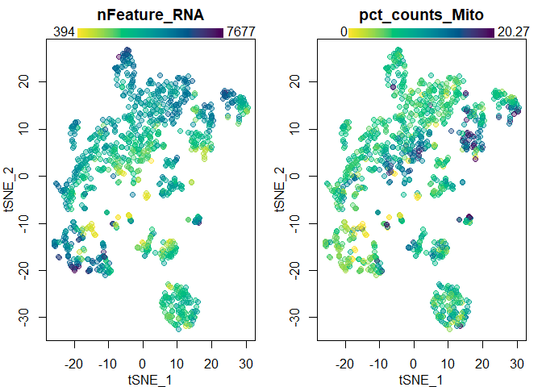
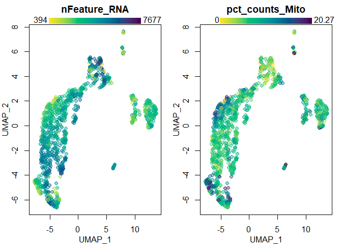

Brendan’s skeleton scRNAseq workflow (v2) using Seurat’s SCTransform and scClustViz
===================================================================================

This RStudio notebook (`scRNAseqWorkflow_v2.Rmd`) reflects my opinion of
best practices in single-sample processing of scRNAseq data from the 10X
Genomics platform. It is heavily based on concepts outlined in the
[SimpleSingleCell](https://bioconductor.org/packages/release/workflows/vignettes/simpleSingleCell/inst/doc/tenx.html)
tutorial, but builds on the popular
[Seurat](https://satijalab.org/seurat/vignettes.html) toolkit.
Normalization is performed using *Seurat’s* new method,
[SCTransform](https://satijalab.org/seurat/v3.1/sctransform_vignette.html).
Clustering is performed iteratively at higher resolutions and stopped
when differential expression between clusters is lost, as assessed by
[scClustViz](https://baderlab.github.io/scClustViz/) using the wilcoxon
rank-sum test.  
For the workflow using [scran](http://bioconductor.org/packages/release/bioc/vignettes/scran/inst/doc/scran.html#3_normalizing_cell-specific_biases), see `scRNAseqWorkflow.Rmd`.  

At the start of every code block there will be variables to edit to
modify the output of that block. I encourage users to run each block
individual, assess the output, and modify as needed. scRNAseq analysis
is not plug-and-play.

``` r
# This code block won't run, but shows the commands to install the required packages

install.packages(c("Seurat","BiocManager","devtools","Matrix"))
BiocManager::install(c("scran","AnnotationDbi","org.Mm.eg.db","org.Hs.eg.db"))
devtools::install_github("immunogenomics/presto")
devtools::install_github("BaderLab/scClustViz")

# Still installing various Bioconductor packages for useful utility functions,
```

``` r
library(Seurat)
library(scClustViz)
```

    ## Loading required package: shiny

``` r
library(org.Mm.eg.db) #library(org.Hs.eg.db) if human
```

    ## Loading required package: AnnotationDbi

    ## Loading required package: stats4

    ## Loading required package: BiocGenerics

    ## Loading required package: parallel

    ## 
    ## Attaching package: 'BiocGenerics'

    ## The following objects are masked from 'package:parallel':
    ## 
    ##     clusterApply, clusterApplyLB, clusterCall, clusterEvalQ,
    ##     clusterExport, clusterMap, parApply, parCapply, parLapply,
    ##     parLapplyLB, parRapply, parSapply, parSapplyLB

    ## The following objects are masked from 'package:stats':
    ## 
    ##     IQR, mad, sd, var, xtabs

    ## The following objects are masked from 'package:base':
    ## 
    ##     anyDuplicated, append, as.data.frame, basename, cbind, colnames,
    ##     dirname, do.call, duplicated, eval, evalq, Filter, Find, get, grep,
    ##     grepl, intersect, is.unsorted, lapply, Map, mapply, match, mget,
    ##     order, paste, pmax, pmax.int, pmin, pmin.int, Position, rank,
    ##     rbind, Reduce, rownames, sapply, setdiff, sort, table, tapply,
    ##     union, unique, unsplit, which, which.max, which.min

    ## Loading required package: Biobase

    ## Welcome to Bioconductor
    ## 
    ##     Vignettes contain introductory material; view with
    ##     'browseVignettes()'. To cite Bioconductor, see
    ##     'citation("Biobase")', and for packages 'citation("pkgname")'.

    ## Loading required package: IRanges

    ## Loading required package: S4Vectors

    ## 
    ## Attaching package: 'S4Vectors'

    ## The following object is masked from 'package:base':
    ## 
    ##     expand.grid

    ## 
    ## Attaching package: 'IRanges'

    ## The following object is masked from 'package:grDevices':
    ## 
    ##     windows

    ## 

Read in data
------------

10X Genomics Cell Ranger v3 uses a much better heuristic for determining
empty droplets, so its generally safe to go straight to using the
filtered matrix. Note that Read10X tries to assign gene symbols to
rownames by default, appending “.\#” to repeat entries of the same gene
name.

``` r
input_from_10x <- "filtered_feature_bc_matrix"

seur <- CreateSeuratObject(counts=Read10X(input_from_10x),
                           min.cells=1,min.features=1)
show(seur)
```

    ## An object of class Seurat 
    ## 18085 features across 1301 samples within 1 assay 
    ## Active assay: RNA (18085 features)

Filter cells
------------

Filtering cells based on the proportion of mitochondrial gene
transcripts per cell. A high proportion of mitochondrial gene
transcripts are indicative of poor quality cells, probably due to
compromised cell membranes.

``` r
mito_gene_identifier <- "^mt-" # "^MT-" if human
mads_thresh <- 4
hard_thresh <- 50

seur <- PercentageFeatureSet(seur, pattern = "^mt-", col.name = "pct_counts_Mito")
mito_thresh <- median(seur$pct_counts_Mito) + mad(seur$pct_counts_Mito) * mads_thresh
drop_mito <- seur$pct_counts_Mito > mito_thresh | seur$pct_counts_Mito > hard_thresh

par(mar=c(3,3,2,1),mgp=2:0)
hist(seur$pct_counts_Mito,breaks=50,xlab="% mitochondrial mRNA")
abline(v=mito_thresh,col="red",lwd=2)
mtext(paste(paste0(mads_thresh," MADs over median: "),
            paste0(round(mito_thresh,2),"% mitochondrial mRNA"),
            paste0(sum(drop_mito)," cells removed"),
            sep="\n"),
      side=3,line=-3,at=mito_thresh,adj=-0.05)
```


``` r
temp_col <- colorspace::sequential_hcl(100,palette="Viridis",alpha=0.5,rev=T)
par(mfrow=c(1,2),mar=c(3,3,2,1),mgp=2:0)
plot(seur$nCount_RNA,seur$nFeature_RNA,log="xy",pch=20,
     xlab="nCount_RNA",ylab="nFeature_RNA",
     col=temp_col[cut(c(0,1,seur$pct_counts_Mito),100,labels=F)[c(-1,-2)]])
legend("topleft",bty="n",title="Mito %",
       legend=c(0,50,100),pch=20,col=temp_col[c(1,50,100)])
plot(seur$nCount_RNA,seur$nFeature_RNA,log="xy",pch=20,
     xlab="nCount_RNA",ylab="total_features",
     col=temp_col[cut(c(0,1,seur$pct_counts_Mito),100,labels=F)[c(-1,-2)]])
points(seur$nCount_RNA[drop_mito],seur$nFeature_RNA[drop_mito],
       pch=4,col="red")
legend("topleft",bty="n",pch=4,col="red",
       title=paste("Mito % >",round(mito_thresh,2)),
       legend=paste(sum(drop_mito),"cells"))
```


``` r
seur <- seur[,!drop_mito]
show(seur)
```

    ## An object of class Seurat 
    ## 18085 features across 1144 samples within 1 assay 
    ## Active assay: RNA (18085 features)

It is important to manually inspect the relationship between library
size and gene detection rates per cell to identify obvious outliers. In
this case, we’ve identified a population of cells with a different
relationship between library size and complexity, as well as one cell
with a clearly outlying library size.

``` r
filt_intercept <- 100
filt_slope <- .055
to_inspect <- seur$nFeature_RNA < (seur$nCount_RNA * filt_slope + filt_intercept)

temp_col <- colorspace::sequential_hcl(100,palette="Viridis",alpha=0.5,rev=T)
par(mfrow=c(1,2),mar=c(3,3,2,1),mgp=2:0)
plot(seur$nCount_RNA,seur$nFeature_RNA,log="",pch=20,
     xlab="nCount_RNA",ylab="total_features",
     main="Select outliers to inspect",
     col=temp_col[cut(c(0,1,seur$pct_counts_Mito),100,labels=F)[c(-1,-2)]])
legend("topleft",bty="n",title="Mito %",
       legend=c(0,50,100),pch=20,col=temp_col[c(1,50,100)])
abline(filt_intercept,filt_slope,lwd=2,col="red")


plot(seur$nCount_RNA,seur$nFeature_RNA,log="xy",pch=20,
     xlab="nCount_RNA",ylab="total_features",
     main="Select outliers to inspect",
     col=temp_col[cut(c(0,1,seur$pct_counts_Mito),100,labels=F)[c(-1,-2)]])
points(seur$nCount_RNA[to_inspect],seur$nFeature_RNA[to_inspect],pch=1,col="red")
legend("topleft",bty="n",pch=1,col="red",legend="Outliers")
```


By comparing the transcriptomes of the outlier cells to the remaining
cells, we see that they’re likely erythrocytes and can be removed.

``` r
in_DR <- RowNNZ(getExpr(seur,"RNA")[,!to_inspect]) / sum(!to_inspect)
out_DR <- RowNNZ(getExpr(seur,"RNA")[,to_inspect]) / sum(to_inspect)
in_MDGE <- pbapply::pbapply(getExpr(seur,"RNA")[,!to_inspect],1,function(X) mean(X[X > 0]))
out_MDGE <- pbapply::pbapply(getExpr(seur,"RNA")[,to_inspect],1,function(X) mean(X[X > 0]))

par(mfrow=c(1,2),mar=c(3,3,2,1),mgp=2:0)
plot(in_DR,in_MDGE,pch=".",cex=2,log="y",
     main="Gene expression in non-outliers",
     xlab="Detection Rate",ylab="Mean Detected Count")
points(in_DR[grep("^Hb[ab]",rownames(seur))],
       in_MDGE[grep("^Hb[ab]",rownames(seur))],
       pch=20,col="red")
plot(out_DR,out_MDGE,pch=".",cex=2,log="y",
     xlab="Detection Rate",ylab="Mean Detected Count",
     main="Gene expression in outliers")
points(out_DR[grep("^Hb[ab]",rownames(seur))],
       out_MDGE[grep("^Hb[ab]",rownames(seur))],
       pch=20,col="red")
legend("topleft",bty="n",pch=20,col="red",legend="Haemoglobin")
```


``` r
remove_outliers <- TRUE

if (remove_outliers) {
  seur <- seur[,!to_inspect]
}
show(seur)
```

    ## An object of class Seurat 
    ## 18085 features across 1112 samples within 1 assay 
    ## Active assay: RNA (18085 features)

Cell cycle prediction with cyclone
----------------------------------

Cyclone (from the *scran* package) generates individual scores for each
cell cycle phase. G1 and G2/M are assigned based on these scores, and
any cells not strongly scoring for either phase are assigned to S phase.

``` r
cycloneSpeciesMarkers <- "mouse_cycle_markers.rds" # "human_cycle_markers.rds"
egDB <- "org.Mm.eg.db" # "org.Hs.eg.db" if human

if (require(scran)) {
  # Cyclone cell-cycle prediction is in the scran package
  anno <- select(get(egDB), keys=rownames(seur), keytype="SYMBOL", column="ENSEMBL")
  cycScores <- cyclone(getExpr(seur,"RNA"),gene.names=anno$ENSEMBL[match(rownames(seur),anno$SYMBOL)],
                       pairs=readRDS(system.file("exdata",cycloneSpeciesMarkers,package="scran")))
  cycScores$phases <- as.factor(cycScores$phases)
  cycScores$confidence <- sapply(seq_along(cycScores$phases),function(i)
    cycScores$normalized.scores[i,as.character(cycScores$phases[i])])
  for (l in names(cycScores)) {
    if (is.null(dim(cycScores[[l]]))) {
      names(cycScores[[l]]) <- colnames(seur)
    } else {
      rownames(cycScores[[l]]) <- colnames(seur)
    }
  }
  seur <- AddMetaData(seur,cycScores$phases,col.name="CyclonePhase")
  seur <- AddMetaData(seur,cycScores$confidence,col.name="CycloneConfidence")
}
```

    ## Loading required package: scran

    ## Loading required package: SingleCellExperiment

    ## Loading required package: SummarizedExperiment

    ## Loading required package: GenomicRanges

    ## Loading required package: GenomeInfoDb

    ## Loading required package: DelayedArray

    ## Loading required package: matrixStats

    ## 
    ## Attaching package: 'matrixStats'

    ## The following objects are masked from 'package:Biobase':
    ## 
    ##     anyMissing, rowMedians

    ## Loading required package: BiocParallel

    ## 
    ## Attaching package: 'DelayedArray'

    ## The following objects are masked from 'package:matrixStats':
    ## 
    ##     colMaxs, colMins, colRanges, rowMaxs, rowMins, rowRanges

    ## The following objects are masked from 'package:base':
    ## 
    ##     aperm, apply, rowsum

    ## 
    ## Attaching package: 'SummarizedExperiment'

    ## The following object is masked from 'package:Seurat':
    ## 
    ##     Assays

    ## 'select()' returned 1:many mapping between keys and columns

``` r
layout(matrix(c(1,2,1,3,1,4),2),widths=c(2,5,1),heights=c(1,9))
par(mar=rep(0,4),mgp=2:0)
plot.new()
title("Cell cycle phase assignment confidence, library sizes, and distribution per sample",line=-2,cex.main=1.5)

par(mar=c(3,3,1,1),bty="n")
boxplot(tapply(cycScores$confidence,cycScores$phases,c),
        col=colorspace::qualitative_hcl(3,alpha=.7,palette="Dark 3"),
        ylab="Normalized score of assigned cell cycle phase")

par(mar=c(3,3,1,1))
cycDlibSize <- tapply(log10(seur$nCount_RNA),cycScores$phases,function(X) density(X))
plot(x=NULL,y=NULL,ylab="Density",xlab=expression(Log[10]~"Library Size"),
     xlim=range(log10(seur$nCount_RNA)),
     ylim=c(min(sapply(cycDlibSize,function(X) min(X$y))),
            max(sapply(cycDlibSize,function(X) max(X$y)))))
for (x in 1:length(cycDlibSize)) {
  lines(cycDlibSize[[x]],lwd=3,
        col=colorspace::qualitative_hcl(3,alpha=.7,palette="Dark 3")[x])
}
legend("topleft",bty="n",horiz=T,lwd=rep(3,3),legend=levels(cycScores$phases),
       col=colorspace::qualitative_hcl(3,alpha=.7,palette="Dark 3"))

par(mar=c(3,3,1,1))
barplot(cbind(table(cycScores$phases)),
  col=colorspace::qualitative_hcl(3,alpha=.7,palette="Dark 3"),
  ylab="Number of cells")
```


Normalization
-------------

See SCTransform.

``` r
seur <- SCTransform(seur,conserve.memory=T,verbose=F)
```

    ## Calculating variance for residuals of type pearson for 14578 genes

    ## 
      |                                                                            
      |                                                                      |   0%
      |                                                                            
      |=                                                                     |   2%
      |                                                                            
      |==                                                                    |   4%
      |                                                                            
      |====                                                                  |   5%
      |                                                                            
      |=====                                                                 |   7%
      |                                                                            
      |======                                                                |   9%
      |                                                                            
      |=======                                                               |  11%
      |                                                                            
      |=========                                                             |  12%
      |                                                                            
      |==========                                                            |  14%
      |                                                                            
      |===========                                                           |  16%
      |                                                                            
      |============                                                          |  18%
      |                                                                            
      |==============                                                        |  19%
      |                                                                            
      |===============                                                       |  21%
      |                                                                            
      |================                                                      |  23%
      |                                                                            
      |=================                                                     |  25%
      |                                                                            
      |==================                                                    |  26%
      |                                                                            
      |====================                                                  |  28%
      |                                                                            
      |=====================                                                 |  30%
      |                                                                            
      |======================                                                |  32%
      |                                                                            
      |=======================                                               |  33%
      |                                                                            
      |=========================                                             |  35%
      |                                                                            
      |==========================                                            |  37%
      |                                                                            
      |===========================                                           |  39%
      |                                                                            
      |============================                                          |  40%
      |                                                                            
      |=============================                                         |  42%
      |                                                                            
      |===============================                                       |  44%
      |                                                                            
      |================================                                      |  46%
      |                                                                            
      |=================================                                     |  47%
      |                                                                            
      |==================================                                    |  49%
      |                                                                            
      |====================================                                  |  51%
      |                                                                            
      |=====================================                                 |  53%
      |                                                                            
      |======================================                                |  54%
      |                                                                            
      |=======================================                               |  56%
      |                                                                            
      |=========================================                             |  58%
      |                                                                            
      |==========================================                            |  60%
      |                                                                            
      |===========================================                           |  61%
      |                                                                            
      |============================================                          |  63%
      |                                                                            
      |=============================================                         |  65%
      |                                                                            
      |===============================================                       |  67%
      |                                                                            
      |================================================                      |  68%
      |                                                                            
      |=================================================                     |  70%
      |                                                                            
      |==================================================                    |  72%
      |                                                                            
      |====================================================                  |  74%
      |                                                                            
      |=====================================================                 |  75%
      |                                                                            
      |======================================================                |  77%
      |                                                                            
      |=======================================================               |  79%
      |                                                                            
      |========================================================              |  81%
      |                                                                            
      |==========================================================            |  82%
      |                                                                            
      |===========================================================           |  84%
      |                                                                            
      |============================================================          |  86%
      |                                                                            
      |=============================================================         |  88%
      |                                                                            
      |===============================================================       |  89%
      |                                                                            
      |================================================================      |  91%
      |                                                                            
      |=================================================================     |  93%
      |                                                                            
      |==================================================================    |  95%
      |                                                                            
      |====================================================================  |  96%
      |                                                                            
      |===================================================================== |  98%
      |                                                                            
      |======================================================================| 100%

    ## Calculating residuals of type pearson for 3000 genes

    ## 
      |                                                                            
      |                                                                      |   0%
      |                                                                            
      |======                                                                |   8%
      |                                                                            
      |============                                                          |  17%
      |                                                                            
      |==================                                                    |  25%
      |                                                                            
      |=======================                                               |  33%
      |                                                                            
      |=============================                                         |  42%
      |                                                                            
      |===================================                                   |  50%
      |                                                                            
      |=========================================                             |  58%
      |                                                                            
      |===============================================                       |  67%
      |                                                                            
      |====================================================                  |  75%
      |                                                                            
      |==========================================================            |  83%
      |                                                                            
      |================================================================      |  92%
      |                                                                            
      |======================================================================| 100%

``` r
# "iteration limit reached" warning can be safely ignored
```

``` r
seur <- CellCycleScoring(seur,
                         g2m.features=cc.genes$g2m.genes,
                         s.features=cc.genes$s.genes)
```

    ## Warning: The following features are not present in the object: MCM5, PCNA, TYMS,
    ## FEN1, MCM2, MCM4, RRM1, UNG, GINS2, MCM6, CDCA7, DTL, PRIM1, UHRF1, MLF1IP,
    ## HELLS, RFC2, RPA2, NASP, RAD51AP1, GMNN, WDR76, SLBP, CCNE2, UBR7, POLD3, MSH2,
    ## ATAD2, RAD51, RRM2, CDC45, CDC6, EXO1, TIPIN, DSCC1, BLM, CASP8AP2, USP1, CLSPN,
    ## POLA1, CHAF1B, BRIP1, E2F8, not searching for symbol synonyms

    ## Warning: The following features are not present in the object: HMGB2, CDK1,
    ## NUSAP1, UBE2C, BIRC5, TPX2, TOP2A, NDC80, CKS2, NUF2, CKS1B, MKI67, TMPO, CENPF,
    ## TACC3, FAM64A, SMC4, CCNB2, CKAP2L, CKAP2, AURKB, BUB1, KIF11, ANP32E, TUBB4B,
    ## GTSE1, KIF20B, HJURP, CDCA3, HN1, CDC20, TTK, CDC25C, KIF2C, RANGAP1, NCAPD2,
    ## DLGAP5, CDCA2, CDCA8, ECT2, KIF23, HMMR, AURKA, PSRC1, ANLN, LBR, CKAP5, CENPE,
    ## CTCF, NEK2, G2E3, GAS2L3, CBX5, CENPA, not searching for symbol synonyms

    ## Warning in AddModuleScore(object = object, features = features, name = name, :
    ## Could not find enough features in the object from the following feature lists:
    ## S.Score Attempting to match case...Could not find enough features in the object
    ## from the following feature lists: G2M.Score Attempting to match case...

``` r
par(mfrow=c(1,2),mar=c(3,3,2,1),mgp=2:0)
temp_cycscores <- sapply(levels(seur$Phase),function(X) 
  getMD(seur)[seur$Phase == X,c("S.Score", "G2M.Score")],simplify=F)
plot(NA,NA,xlim=range(seur$S.Score),ylim=range(seur$G2M.Score),
     xlab="S.Score",ylab="G2M.Score",main="Cell cycle assignment confidence")
for (X in seq_along(temp_cycscores)) {
  points(temp_cycscores[[X]]$S.Score,temp_cycscores[[X]]$G2M.Score,
         pch=20,col=colorspace::qualitative_hcl(3,alpha=.7,palette="Dark 3")[X])
}
legend("topright",bty="n",pch=20,
       col=colorspace::qualitative_hcl(3,alpha=.7,palette="Dark 3"),
       legend=names(temp_cycscores))

cycDlibSize <- tapply(log10(seur$nCount_SCT),seur$Phase,function(X) density(X))
plot(x=NULL,y=NULL,main="Cell cycle library size",
     ylab="Density",xlab=expression(Log[10]~"Corrected Library Size"),
     xlim=range(log10(seur$nCount_SCT)),
     ylim=c(min(sapply(cycDlibSize,function(X) min(X$y))),
            max(sapply(cycDlibSize,function(X) max(X$y)))))
for (x in 1:length(cycDlibSize)) {
  lines(cycDlibSize[[x]],lwd=3,
        col=colorspace::qualitative_hcl(3,alpha=.7,palette="Dark 3")[x])
}
legend("topleft",bty="n",horiz=T,lwd=rep(3,3),legend=levels(cycScores$phases),
       col=colorspace::qualitative_hcl(3,alpha=.7,palette="Dark 3"))
```


``` r
seur <- RunPCA(seur,assay="SCT",verbose=F)
plot(100 * seur@reductions$pca@stdev^2 / seur@reductions$pca@misc$total.variance,
     pch=20,xlab="Principal Component",ylab="% variance explained",log="y")
```


Select the number of principle components to use in downstream analysis,
and set *n\_pc* accordingly.

``` r
n_pc <- 23

temp_keepMD <- sapply(getMD(seur),function(X) {
  if (is.factor(X)) { 
    if (length(levels(X)) == 1) {
      FALSE
    } else {
      TRUE
    }
  } else {
    TRUE
  }
})
seur@meta.data <- seur@meta.data[temp_keepMD]
pc_corrs <- sapply(getMD(seur),function(MD) {
  if (is.numeric(MD)) {
    cor(getEmb(seur,"pca")[,1:n_pc],MD)
  } else {
    apply(getEmb(seur,"pca")[,1:n_pc],2,function(Y)
      sqrt(summary(lm(Y~MD))$adj.r.squared))
  }
})
```

    ## Warning in sqrt(summary(lm(Y ~ MD))$adj.r.squared): NaNs produced

    ## Warning in sqrt(summary(lm(Y ~ MD))$adj.r.squared): NaNs produced

    ## Warning in sqrt(summary(lm(Y ~ MD))$adj.r.squared): NaNs produced

    ## Warning in sqrt(summary(lm(Y ~ MD))$adj.r.squared): NaNs produced

    ## Warning in sqrt(summary(lm(Y ~ MD))$adj.r.squared): NaNs produced

    ## Warning in sqrt(summary(lm(Y ~ MD))$adj.r.squared): NaNs produced

    ## Warning in sqrt(summary(lm(Y ~ MD))$adj.r.squared): NaNs produced

    ## Warning in sqrt(summary(lm(Y ~ MD))$adj.r.squared): NaNs produced

    ## Warning in sqrt(summary(lm(Y ~ MD))$adj.r.squared): NaNs produced

    ## Warning in sqrt(summary(lm(Y ~ MD))$adj.r.squared): NaNs produced

``` r
par(mfrow=c(2,2),mar=4:1,mgp=2:0)
for (X in colnames(pc_corrs)) {
  barplot(pc_corrs[,X],las=3,main=X,ylab=paste("Corr w/",X),
          ylim=switch((min(pc_corrs[,X],na.rm=T) < 0) + 1,c(0,1),c(-1,1)))
}
```


Check to see that no PC strongly correlates with technical factors in an
unexpected manner. For categorical factors, the adjusted R^2 value of a
logistic regression was used to calculate correlation.  
If there is strong correlation with technical factors, these can be
regressed out in the `SCTransform` function.

``` r
seur <- RunTSNE(seur,dims=1:n_pc,reduction="pca",perplexity=30)
par(mfrow=c(1,2))
plot_tsne(cell_coord=getEmb(seur,"tsne"),
          md=getMD(seur)$nFeature_RNA,
          md_title="nFeature_RNA",
          md_log=F)
plot_tsne(cell_coord=getEmb(seur,"tsne"),
          md=getMD(seur)$pct_counts_Mito,
          md_title="pct_counts_Mito",
          md_log=F)
```



``` r
plot_tsne(cell_coord=getEmb(seur,"tsne"),
          md=getMD(seur)$CyclonePhase,
          md_title="CyclonePhase")
plot_tsne(cell_coord=getEmb(seur,"tsne"),
          md=getMD(seur)$Phase,
          md_title="Phase")
```


Playing with the perplexity parameter can improve the visualization.
Perplexity can be interpretted as the number of nearby cells to consider
when trying to minimize distance between neighbouring cells.

``` r
# only run if you've installed UMAP - see ?RunUMAP

seur <- RunUMAP(seur,dims=1:n_pc,reduction="pca")
```

    ## Warning: The default method for RunUMAP has changed from calling Python UMAP via reticulate to the R-native UWOT using the cosine metric
    ## To use Python UMAP via reticulate, set umap.method to 'umap-learn' and metric to 'correlation'
    ## This message will be shown once per session

    ## 16:25:07 UMAP embedding parameters a = 0.9922 b = 1.112

    ## 16:25:07 Read 1112 rows and found 23 numeric columns

    ## 16:25:07 Using Annoy for neighbor search, n_neighbors = 30

    ## 16:25:07 Building Annoy index with metric = cosine, n_trees = 50

    ## 0%   10   20   30   40   50   60   70   80   90   100%

    ## [----|----|----|----|----|----|----|----|----|----|

    ## **************************************************|
    ## 16:25:08 Writing NN index file to temp file C:\Users\binnes\AppData\Local\Temp\RtmpeqTto3\file3240229f348
    ## 16:25:08 Searching Annoy index using 1 thread, search_k = 3000
    ## 16:25:08 Annoy recall = 100%
    ## 16:25:08 Commencing smooth kNN distance calibration using 1 thread
    ## 16:25:09 Initializing from normalized Laplacian + noise
    ## 16:25:09 Commencing optimization for 500 epochs, with 39502 positive edges
    ## 16:25:13 Optimization finished

``` r
par(mfrow=c(1,2))
plot_tsne(cell_coord=getEmb(seur,"umap"),
          md=getMD(seur)$nFeature_RNA,
          md_title="nFeature_RNA",
          md_log=F)
plot_tsne(cell_coord=getEmb(seur,"umap"),
          md=getMD(seur)$pct_counts_Mito,
          md_title="pct_counts_Mito",
          md_log=F)
```



``` r
plot_tsne(cell_coord=getEmb(seur,"umap"),
          md=getMD(seur)$CyclonePhase,
          md_title="CyclonePhase")
plot_tsne(cell_coord=getEmb(seur,"umap"),
          md=getMD(seur)$Phase,
          md_title="Phase")
```


Iterative clustering with scClustViz
------------------------------------

Seurat implements an interpretation of SNN-Cliq
(<a href="https://doi.org/10.1093/bioinformatics/btv088" class="uri">https://doi.org/10.1093/bioinformatics/btv088</a>)
for clustering of single-cell expression data. They use PCs to define
the distance metric, then embed the cells in a graph where edges between
cells (nodes) are weighted based on their similarity (euclidean distance
in PCA space). These edge weights are refined based on Jaccard distance
(overlap in local neighbourhoods), and then communities
(“quasi-cliques”) are identified in the graph using a smart local moving
algorithm (SLM,
<a href="http://dx.doi.org/10.1088/1742-5468/2008/10/P10008" class="uri">http://dx.doi.org/10.1088/1742-5468/2008/10/P10008</a>)
to optimize the modularity measure of the defined communities in the
graph.

This code block iterates through “resolutions” of the Seurat clustering
method, testing each for overfitting. Overfitting is determined by
testing differential expression between all pairs of clusters using a
wilcoxon rank-sum test. If there are no significantly differentially
expressed genes between nearest neighbouring clusters, iterative
clustering is stopped. The output is saved as an sCVdata object for use
in scClustViz.

``` r
max_seurat_resolution <- 0.6 # For the sake of the demo, quit early.
## ^ change this to something large (5?) to ensure iterations stop eventually.
output_filename <- "./for_scClustViz_v2.RData"
FDRthresh <- 0.01 # FDR threshold for statistical tests
min_num_DE <- 1
seurat_resolution <- 0 # Starting resolution is this plus the jump value below.
seurat_resolution_jump <- 0.2

seur <- FindNeighbors(seur,reduction="pca",dims=1:n_pc,verbose=F)

sCVdata_list <- list()
DE_bw_clust <- TRUE
while(DE_bw_clust) {
  if (seurat_resolution >= max_seurat_resolution) { break }
  seurat_resolution <- seurat_resolution + seurat_resolution_jump 
  # ^ iteratively incrementing resolution parameter 
  
  seur <- FindClusters(seur,resolution=seurat_resolution,verbose=F)
  
  message(" ")
  message("------------------------------------------------------")
  message(paste0("--------  res.",seurat_resolution," with ",
                 length(levels(Idents(seur)))," clusters --------"))
  message("------------------------------------------------------")
  
  if (length(levels(Idents(seur))) <= 1) { 
    message("Only one cluster found, skipping analysis.")
    next 
  } 
  # ^ Only one cluster was found, need to bump up the resolution!
  
  if (length(sCVdata_list) >= 1) {
    temp_cl <- length(levels(Clusters(sCVdata_list[[length(sCVdata_list)]])))
    if (temp_cl == length(levels(Idents(seur)))) { 
      temp_cli <- length(levels(interaction(
        Clusters(sCVdata_list[[length(sCVdata_list)]]),
        Idents(seur),
        drop=T
      )))
      if (temp_cli == length(levels(Idents(seur)))) { 
        message("Clusters unchanged from previous, skipping analysis.")
        seur@meta.data <- seur@meta.data[,colnames(seur@meta.data) != "seurat_clusters"]
        seur@meta.data <- seur@meta.data[,-ncol(seur@meta.data)]
        next 
      }
    }
  }
  seur@meta.data <- seur@meta.data[,colnames(seur@meta.data) != "seurat_clusters"]
  if (all(Idents(seur) == seur@meta.data[,ncol(seur@meta.data)])) {
    levels(seur@meta.data[,ncol(seur@meta.data)]) <- 
      as.integer(levels(seur@meta.data[,ncol(seur@meta.data)])) + 1
    seur@active.ident <- seur@meta.data[,ncol(seur@meta.data)]
    names(seur@active.ident) <- rownames(seur@meta.data)
  } else {
    stop("Made stupid assumptions about Seurat's metadata / cluster organization.")
  }
  
  curr_sCVdata <- CalcSCV(
    inD=seur,
    assayType="SCT",
    assaySlot="counts",
    cl=seur@meta.data[,ncol(seur@meta.data)], 
    # ^ your most recent clustering results get stored in the Seurat "ident" slot
    exponent=NA, 
    # ^ going to use the corrected counts from SCTransform
    pseudocount=NA,
    DRthresh=0.1,
    DRforClust="pca",
    calcSil=T,
    calcDEvsRest=T,
    calcDEcombn=T
  )
  
  DE_bw_NN <- sapply(DEneighb(curr_sCVdata,FDRthresh),nrow)
  # ^ counts # of DE genes between neighbouring clusters at your selected FDR threshold
  message(paste("Number of DE genes between nearest neighbours:",min(DE_bw_NN)))
  
  if (min(DE_bw_NN) < min_num_DE) { DE_bw_clust <- FALSE }
  # ^ If no DE genes between nearest neighbours, don't loop again.
  
  sCVdata_list[[colnames(seur@meta.data)[ncol(seur@meta.data)]]] <- curr_sCVdata
}
```

    ## 

    ## ------------------------------------------------------

    ## --------  res.0.2 with 6 clusters --------

    ## ------------------------------------------------------

    ## Loading required package: cluster

    ## -- Calculating cluster-wise gene statistics --

    ## -- Calculating differential expression cluster vs rest effect size --

    ## Loading required package: presto

    ## Loading required package: Rcpp

    ## -- Testing differential expression cluster vs rest --

    ## -- Testing differential expression between clusters --

    ## Number of DE genes between nearest neighbours: 178

    ## 

    ## ------------------------------------------------------

    ## --------  res.0.4 with 9 clusters --------

    ## ------------------------------------------------------

    ## -- Calculating cluster-wise gene statistics --

    ## -- Calculating differential expression cluster vs rest effect size --

    ## -- Testing differential expression cluster vs rest --

    ## -- Testing differential expression between clusters --

    ## Number of DE genes between nearest neighbours: 51

    ## 

    ## ------------------------------------------------------

    ## --------  res.0.6 with 10 clusters --------

    ## ------------------------------------------------------

    ## -- Calculating cluster-wise gene statistics --

    ## -- Calculating differential expression cluster vs rest effect size --

    ## -- Testing differential expression cluster vs rest --

    ## -- Testing differential expression between clusters --

    ## Number of DE genes between nearest neighbours: 78

``` r
seur <- DietSeurat(seur,dimreducs=Reductions(seur))
# ^ shrinks the size of the Seurat object by removing the scaled matrix

save(sCVdata_list,seur,file=output_filename)
```

View the scClustViz report by running this code chunk.

``` r
runShiny(output_filename,
         cellMarkers=list( #change this to suit your needs, or remove it
           "Cortical precursors"=c("Mki67","Sox2","Pax6","Pcna",
                                   "Nes","Cux1","Cux2"), 
           "Interneurons"=c("Gad1","Gad2","Npy","Sst","Lhx6",
                            "Tubb3","Rbfox3","Dcx"), 
           "Cajal-Retzius neurons"="Reln", 
           "Intermediate progenitors"="Eomes", 
           "Projection neurons"=c("Tbr1","Satb2","Fezf2","Bcl11b","Tle4","Nes",
                                  "Cux1","Cux2","Tubb3","Rbfox3","Dcx")
         ),
         annotationDB="org.Mm.eg.db" #"org.Hs.eg.db" for human
)
```
